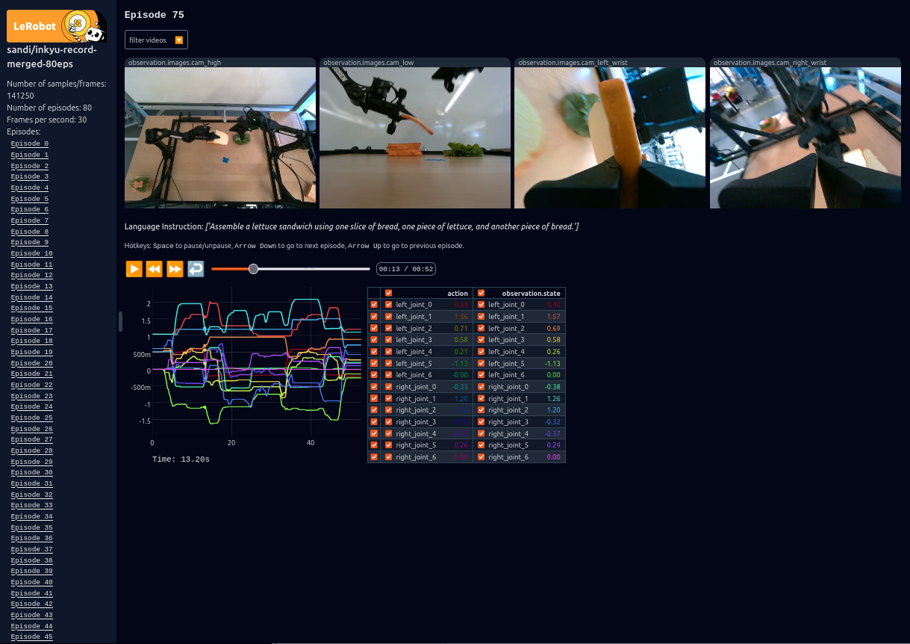
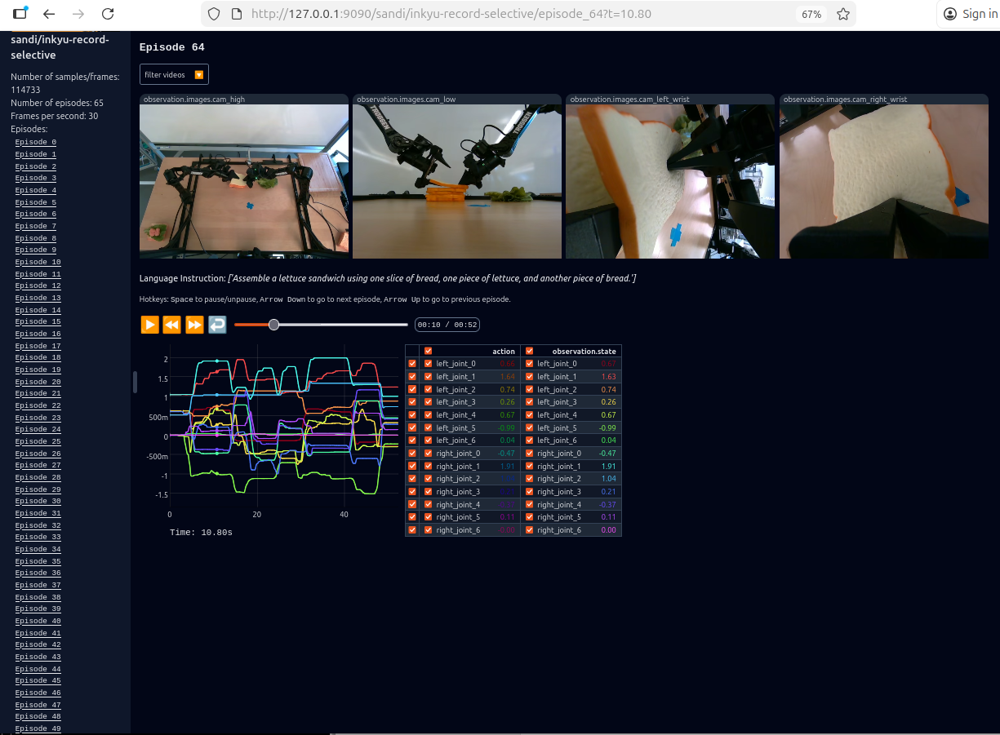
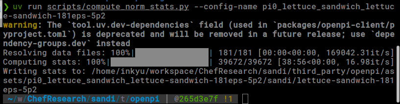

Chatgpt-generated

# 📦 Dataset Merge Utility

A lightweight Python tool for **merging multiple episodic datasets** (LeRobot/OpenPI-style) with flexible **episode-selection rules**, allowing you to include, exclude, or slice specific episode ranges from each input dataset.

This tool is especially useful when working with large episodic datasets (e.g., robotics rollouts, RL episodes, or segmentation sequences) where you need to trim, merge, or selectively filter episodes before training downstream models.

---

## ✅ Features

- Merge **any number of datasets** into one output directory
- Per-dataset episode filters via **YAML config**:
  - Include specific episodes
  - Include ranges (`[start, end)`)
  - Exclude episodes / ranges
  - Combine include + exclude logic
- CLI-based: no need to edit the script for new merges
- Preserves relative episode ordering while **reindexing globally**
- Merges and **reindexes**:
  - `data/chunk-000/episode_*.parquet`
  - `videos/chunk-000/*/episode_*.mp4` (per camera)
  - `meta/episodes.jsonl`, `meta/episodes_stats.jsonl`, `meta/tasks.jsonl`, `meta/info.json`

### 🔢 Reindexing Behavior (Important)

When merging, each episode’s parquet is rewritten so that:

- `episode_index` = **new global episode id** (0..`total_episodes-1`)
- `frame_index` = **0..(episode_length-1)** inside each episode
- `index` = **global frame index** over the entire merged dataset (0..`total_frames-1`)

This avoids phantom episodes (e.g. 181, 192, …) and keeps the merged dataset fully consistent with LeRobot / OpenPI expectations.

---

## 🖼️ Result Preview

### ✔️ Merged Dataset

The image below shows a merged dataset created by this tool **without any filtering**:  
`Data1` has 30 episodes and `Data2` has 50. After the merge, we have **80 episodes**.

To do this, use a config like:

```yaml
# configs/config_all.yaml

"/home/inkyu/workspace/dataset/sandi/inkyu-record02-30eps": {}
"/home/inkyu/workspace/dataset/sandi/inkyu-record03-50eps": {}
````

and run:

```bash
python merge_datasets.py \
  --input /home/inkyu/workspace/dataset/sandi/inkyu-record02-30eps \
  --input /home/inkyu/workspace/dataset/sandi/inkyu-record03-50eps \
  --output /home/inkyu/workspace/dataset/sandi/inkyu-record-merged-all \
  --config configs/config_all.yaml
```



---

### ✔️ Selectively Trimmed & Merged Episodes

This example demonstrates **selective trimming + merging**.

We have two datasets (30 and 50 episodes).
We want to:

* keep only episodes **0..14** (15 episodes) from the first dataset
* keep **all** episodes from the second dataset

Config:

```yaml
# configs/config_selective_first15.yaml

"/home/inkyu/workspace/dataset/sandi/inkyu-record02-30eps":
  include_ranges:
    - [0, 15]    # keep episodes 0..14

"/home/inkyu/workspace/dataset/sandi/inkyu-record03-50eps": {}  # keep all
```

Run:

```bash
python merge_datasets.py \
  --input /home/inkyu/workspace/dataset/sandi/inkyu-record02-30eps \
  --input /home/inkyu/workspace/dataset/sandi/inkyu-record03-50eps \
  --output /home/inkyu/workspace/dataset/sandi/inkyu-record-merged-selective \
  --config configs/config_selective_first15.yaml
```



---

## ⚙️ CLI & Configuration

### Script entrypoint

The script is designed to be driven entirely by **command-line arguments** + a **YAML config**:

```bash
python merge_datasets.py \
  --input /path/to/dataset1 \
  --input /path/to/dataset2 \
  --output /path/to/merged_dataset \
  --config configs/config_selective_first15.yaml
```

### `argparse` options

* `--input PATH`

  * Path to an **input dataset root** (LeRobot/OpenPI-style layout).
  * You can supply this **multiple times** for multi-dataset merge:

    * `--input ds1 --input ds2 --input ds3`

* `--output PATH`

  * Path to the **output merged dataset root**.

* `--config PATH`

  * Path to a **YAML config file** describing selection rules **per dataset**.
  * Keys must match the **absolute paths** of the input datasets (the script prints these at startup).

Example:

```bash
python merge_datasets.py \
  --input /home/inkyu/workspace/dataset/sandi/inkyu-record02-30eps \
  --input /home/inkyu/workspace/dataset/sandi/inkyu-record03-50eps \
  --output /home/inkyu/workspace/dataset/sandi/inkyu-record-merged-test \
  --config configs/config_all.yaml
```

---

## 🧾 YAML Config Structure

Each YAML file maps:

```text
"<absolute/path/to/dataset>": { selection config }
```

If a dataset is **not present** in the YAML, the script treats it as:

```yaml
"/abs/path/to/dataset": {}
```

(i.e., **keep all episodes**).

### Example: merge all

```yaml
"/home/inkyu/workspace/dataset/sandi/inkyu-record02-30eps": {}
"/home/inkyu/workspace/dataset/sandi/inkyu-record03-50eps": {}
```

### Example: first dataset truncated to 0..14, second all

```yaml
"/home/inkyu/workspace/dataset/sandi/inkyu-record02-30eps":
  include_ranges:
    - [0, 15]

"/home/inkyu/workspace/dataset/sandi/inkyu-record03-50eps": {}
```

---

## 🧠 Episode Filtering Guide (YAML)

Below are **per-dataset** selection patterns you can drop into your YAML values.

> All ranges are `[start, end)` – **end is exclusive**.
> Episode indices are **local** to each dataset (0-based).

### 1. Keep **all** episodes

```yaml
"/abs/path/to/dataset": {}
```

or simply omit it from the config (it will default to `{}`).

---

### 2. Keep first N episodes (e.g., first 15)

```yaml
"/abs/path/to/dataset":
  include_ranges:
    - [0, 15]    # 0..14
```

---

### 3. Keep last N episodes (e.g., last 10 of 30)

```yaml
"/abs/path/to/dataset":
  include_ranges:
    - [20, 30]   # 20..29
```

(assuming 30 episodes: 0..29)

---

### 4. Keep multiple ranges

```yaml
"/abs/path/to/dataset":
  include_ranges:
    - [0, 5]     # 0..4
    - [10, 15]   # 10..14
```

---

### 5. Exclude a range

```yaml
"/abs/path/to/dataset":
  exclude_ranges:
    - [10, 20]   # drop 10..19
```

---

### 6. Exclude multiple ranges

```yaml
"/abs/path/to/dataset":
  exclude_ranges:
    - [0, 5]     # drop 0..4
    - [15, 18]   # drop 15..17
```

---

### 7. Keep specific episodes only

```yaml
"/abs/path/to/dataset":
  include:
    - 0
    - 3
    - 5
    - 6
    - 22
```

---

### 8. Remove specific episodes

```yaml
"/abs/path/to/dataset":
  exclude:
    - 1
    - 2
    - 7
    - 10
```

---

### 9. Combine include + exclude

Keep the first 20 episodes, then drop 5–9 inside that block:

```yaml
"/abs/path/to/dataset":
  include_ranges:
    - [0, 20]     # start with 0..19
  exclude_ranges:
    - [5, 10]     # drop 5..9
```

---

## 📜 Selection Rules (Recap)

* If `include` or `include_ranges` is present → **only** those episodes are considered.
* `exclude` and `exclude_ranges` are applied **after** includes.
* An empty config `{}` means **keep all episodes** for that dataset.
* Episode indices are **local** to each dataset and **0-based**.

---

## 🧬 Under the Hood: What Gets Rewritten

For each selected episode in each input dataset:

1. The script reads `data/chunk-000/episode_XXXXXX.parquet`.
2. It rewrites three key columns:

   * `episode_index` → new global episode id for the merged dataset
   * `frame_index` → 0..(length-1) for that episode
   * `index` → global 0..(total_frames-1) across *all* merged episodes
3. It writes the updated parquet as `episode_{new_idx:06d}.parquet` in the output dataset.
4. It copies any corresponding video files:

   * `videos/chunk-000/<camera>/episode_{old_idx:06d}.mp4`
     → `videos/chunk-000/<camera>/episode_{new_idx:06d}.mp4`
5. It remaps:

   * `meta/episodes.jsonl`
   * `meta/episodes_stats.jsonl`
     using the per-dataset mapping `old_idx → new_idx`.
6. It rebuilds:

   * `meta/tasks.jsonl` from the merged `episodes.jsonl`.
7. It regenerates:

   * `meta/info.json` with correct `total_episodes`, `total_frames`, `total_tasks`,
     `total_videos`, and `splits["train"]`.

This ensures the merged dataset looks like it was recorded as a single coherent dataset in the first place.

---

## 📁 Example `configs/` Folder

You can collect your presets into a `configs/` directory:

```text
configs/
├── config_all.yaml
├── config_selective_first15.yaml
├── config_exclude10_19.yaml
├── config_specific_episodes.yaml
├── config_multirange.yaml
├── config_two_datasets_last10.yaml
├── config_three_datasets_basic.yaml
├── config_three_datasets_selective.yaml
├── config_trim_first150.yaml
├── config_skip_multiple.yaml
├── config_single_dataset.yaml
└── config_mixed_complex.yaml
```

Each file documents a particular merge scenario (full merge, selective subsets, multi-dataset merges, etc.).

---

## 🚀 Usage Summary

Basic usage pattern:

```bash
python merge_datasets.py \
  --input /path/to/dataset1 \
  --input /path/to/dataset2 \
  --output /path/to/merged_dataset \
  --config configs/some_config.yaml
```

The tool will:

1. Scan `data/chunk-000/episode_*.parquet` for episode indices.
2. Apply your YAML selection rules per dataset.
3. For each selected episode:

   * Rewrite and reindex its parquet (`episode_index`, `frame_index`, `index`)
   * Copy matching video files for all cameras
4. Merge and remap `meta`:

   * `episodes.jsonl`
   * `episodes_stats.jsonl`
   * `tasks.jsonl` (rebuilt from merged episodes)
   * `info.json` (merged counts and splits)


Running `compute_norm_stats` proves that the merge was succeeful. Because this checks dataset sanity including timestamp sync for joint states and the corresponding camera image frames etc.




Result: a single, clean, globally reindexed dataset ready for training.

---